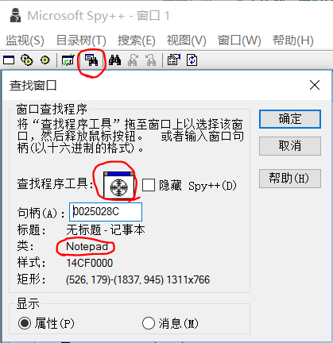
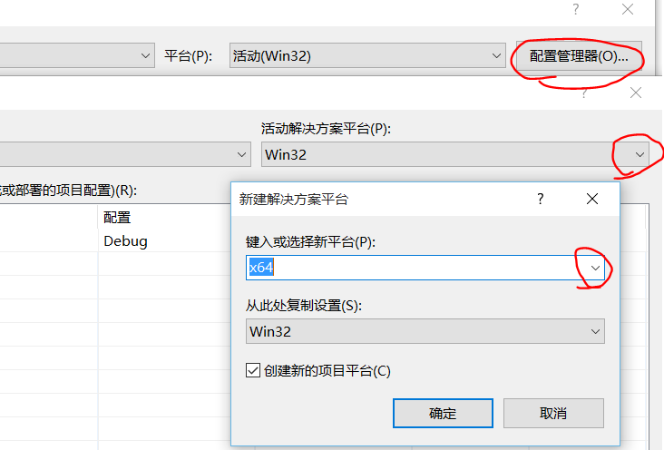

##教程一：键盘鼠标模拟
原创 2015年11月15日
>本教程面向有C\C++基础的人，最好还要懂一些Windows编程知识
代码一律用Visual Studio 2013编译，如果你还在用VC6请趁早丢掉它...
写这个教程只是为了让玩家更好地体验所爱的单机游戏，顺便学到些逆向知识，我不会用网络游戏做示范，请自重

先从最简单的模拟操作讲起
模拟键盘鼠标有很多方法，我大体分为消息模拟、API模拟、驱动模拟
对于网页的话还可以用JavaScript模拟，虽然这不在本教程范围

###消息模拟
学习Windows编程都知道Windows程序会响应窗口消息，那么我们自己发个消息过去程序就会认为是人在操作而响应了
**看看要用到的API**

	// 发送消息到指定窗口，不用等待消息处理就返回，参数和窗口过程里的一样  
	BOOL WINAPI PostMessage(  
	  _In_opt_ HWND   hWnd,  
	  _In_     UINT   Msg,  
	  _In_     WPARAM wParam,  
	  _In_     LPARAM lParam  
	);  
	// 获取窗口句柄，参数是窗口类名和窗口标题，其中一个可以传入NULL表示通配  
	HWND FindWindow(   
	  LPCTSTR lpClassName,   
	  LPCTSTR lpWindowName   
	);  
	// 用来获取子窗口句柄  
	HWND WINAPI FindWindowEx(  
	  _In_opt_ HWND    hwndParent,  
	  _In_opt_ HWND    hwndChildAfter,  
	  _In_opt_ LPCTSTR lpszClass,  
	  _In_opt_ LPCTSTR lpszWindow  
	);  

**以记事本为例子**
首先要知道记事本的窗口类名
打开记事本，打开VS2013，在工具里找到spy++

在工具条找到查找窗口，把查找程序工具拖到记事本窗口，得到了记事本窗口的类名"Notepad"

同理可以知道编辑框的类名是Edit
我们写个程序模拟在编辑框按下A健

	HWND notepadWnd = FindWindow(_T("Notepad"), NULL); // 记事本窗口句柄  
	if (notepadWnd == NULL)  
	{  
	    printf("没有找到记事本窗口\n");  
	    return 0;  
	}  
	HWND editWnd = FindWindowEx(notepadWnd, NULL, _T("Edit"), NULL); // 编辑框窗口句柄  
	  
	const BYTE vk = 'A'; // 虚拟键码  
	//UINT scanCode = MapVirtualKey(vk, MAPVK_VK_TO_VSC); // 扫描码  
	PostMessage(editWnd, WM_KEYDOWN, vk, 1 /*| scanCode << 16*/);  
	Sleep(100);  
	PostMessage(editWnd, WM_KEYUP, vk, 1 /*| scanCode << 16*/ | 1 << 30 | 1 << 31); 

运行程序，看看记事本里是不是多了个a
**再写个程序模拟点击鼠标右键**
用到的新API

	// 取坐标处窗口句柄  
	HWND WINAPI WindowFromPoint(  
	  _In_ POINT Point  
	);  
	// 取鼠标坐标  
	BOOL WINAPI GetCursorPos(  
	  _Out_ LPPOINT lpPoint  
	);  
	// 把屏幕坐标转为相对于窗口客户区的坐标  
	BOOL ScreenToClient(  
	  _In_ HWND    hWnd,  
	       LPPOINT lpPoint  
	); 
模拟鼠标右键点击的程序

	Sleep(3000); // 等待3秒把鼠标移到指定窗口  
	  
	POINT pos; // 鼠标坐标  
	GetCursorPos(&pos);  
	HWND wnd = WindowFromPoint(pos); // 鼠标指向的窗口的句柄  
	ScreenToClient(wnd, &pos); // 把pos转成相对于窗口客户区的坐标  
	LPARAM lParam = MAKELPARAM(pos.x, pos.y);  
	  
	PostMessage(wnd, WM_RBUTTONDOWN, 0, lParam);  
	Sleep(100);  
	PostMessage(wnd, WM_RBUTTONUP, 0, lParam);
运行后把鼠标移到记事本，会弹出菜单
发送消息模拟输入的方法好处是就算窗口最小化了也可以模拟，但是缺点是不是所有程序都会处理窗口消息，比如大部分游戏是用DInput输入的

###API模拟
API模拟就是用Windows提供的API模拟输入，比如keybd_event、mouse_event、SendInput，但是微软建议用SendInput代替另外两个，那我就只讲SendInput怎么用了

**用到的API**

	UINT WINAPI SendInput(  
	  _In_ UINT    nInputs,  
	  _In_ LPINPUT pInputs,  
	  _In_ int     cbSize  
	);  
	  
	typedef struct tagINPUT {  
	  DWORD type;  
	  union {  
	    MOUSEINPUT    mi;  
	    KEYBDINPUT    ki;  
	    HARDWAREINPUT hi;  
	  };  
	} INPUT, *PINPUT;

这个API可以模拟键盘按下、鼠标移动、鼠标点击等事件，参数是INPUT结构的数量、INPUT数组的指针、INPUT结构的大小
INPUT中type取值为INPUT_MOUSE、INPUT_KEYBOARD、INPUT_HARDWARE，分别表示使用mi、ki、hi结构
详细说明请看MSDN：
[MOUSEINPUT][link01]
[KEYBDINPUT][link02]
[link01]:https://msdn.microsoft.com/zh-cn/office/ms646273(v=vs.100)
[link02]:https://msdn.microsoft.com/zh-cn/office/ms646271(v=vs.100)
**模拟鼠标移动到屏幕中间点击右键**

	INPUT input[3];  
	ZeroMemory(&input, sizeof(input));  
	// 鼠标移动到屏幕中间，也可以用SetCursorPos(x, y)  
	input[0].type = INPUT_MOUSE;  
	input[0].mi.dx = 65535 / 2; // 坐标取值范围是0-65535  
	input[0].mi.dy = 65535 / 2;  
	input[0].mi.dwFlags = MOUSEEVENTF_MOVE | MOUSEEVENTF_ABSOLUTE;  
	// 点击鼠标右键  
	input[1].type = INPUT_MOUSE;  
	input[1].mi.dwFlags = MOUSEEVENTF_RIGHTDOWN;  
	input[2].type = INPUT_MOUSE;  
	input[2].mi.dwFlags = MOUSEEVENTF_RIGHTUP;  
	  
	SendInput(_countof(input), input, sizeof(INPUT));

**模拟按下A键**

	INPUT input[2];  
	ZeroMemory(&input, sizeof(input));  
	input[0].type = INPUT_KEYBOARD;  
	input[0].ki.wVk = 'A';  
	// 也可以不加这句但是对DInput输入的程序会没用  
	input[0].ki.wScan = MapVirtualKey(input[0].ki.wVk, MAPVK_VK_TO_VSC);  
	input[1].type = INPUT_KEYBOARD;  
	input[1].ki.wVk = input[0].ki.wVk;  
	input[1].ki.wScan = input[0].ki.wScan;  
	input[1].ki.dwFlags = KEYEVENTF_KEYUP;  
	  
	SendInput(_countof(input), input, sizeof(INPUT));

**来个高级点的例子：东方花映冢Z键连打**
东方花映冢里想发轻弹幕就要不停按Z键，这样很费劲，所以我想实现按住C键就能自动发轻弹幕的功能（就像妖精大战争那样）
这个程序用到了MFC，看不懂的话建议学一下MFC编程

	// 开启  
	void CC2ZDlg::OnBnClickedButton1()  
	{  
	    m_enableButton.EnableWindow(FALSE);  
	    m_disableButton.EnableWindow(TRUE);  
	    SetTimer(1, 200, timerProc); // 每0.2s检测C键是否按下，并模拟Z键  
	}  
	  
	// 关闭  
	void CC2ZDlg::OnBnClickedButton2()  
	{  
	    m_enableButton.EnableWindow(TRUE);  
	    m_disableButton.EnableWindow(FALSE);  
	    KillTimer(1);  
	}  
	  
	//定时模拟按下Z  
	void CALLBACK CC2ZDlg::timerProc(HWND hWnd, UINT nMsg, UINT nTimerid, DWORD dwTime)  
	{  
	    if ((GetKeyState('C') & (1 << 15)) != 0) // C键按下  
	    {  
	        INPUT input;  
	        ZeroMemory(&input, sizeof(input));  
	        input.type = INPUT_KEYBOARD;  
	        input.ki.wVk = 'Z';  
	        input.ki.wScan = MapVirtualKey(input.ki.wVk, MAPVK_VK_TO_VSC);  
	        SendInput(1, &input, sizeof(INPUT)); // 按下Z键  
	        Sleep(100); // 可能东方是在处理逻辑时检测一下Z键是否按下才发弹幕，如果这时Z键刚好弹起就没有反应，所以要延迟一下  
	        input.ki.dwFlags = KEYEVENTF_KEYUP;  
	        SendInput(1, &input, sizeof(INPUT)); // 弹起Z键  
	    }  
	}
[完整源码][link03]
[link03]:https://github.com/xfgryujk/CheatingTutorial/tree/master/C2Z
这样就可以模拟大部分游戏的输入了，但是有些游戏会有保护，这样就要用到驱动模拟

###驱动模拟
驱动模拟就是自己写驱动程序，在系统内核里面操作I/O端口，给连接键盘的集成电路（一般是8042芯片）发送指令，让它产生一个按下按键的信息，这样你的模拟输入对于所有程序来说就是从一个真实的设备发出的，而且可以绕过很多保护
（需要操作I/O端口的话可以学习一下**WinIo库**）
然而我并不会写这种驱动_(:з」∠)_，而且x64系统中加载驱动需要有可信任的数字签名，否则会比较麻烦，而且还要知道8042芯片相关的底层知识...
所以我找了个别人写的库实现驱动模拟
[Interception官网][link04]
[Interception API的Git库][link05]
[link04]:http://www.oblita.com/interception
[link05]:https://github.com/oblitum/Interception
它的驱动有数字签名而且在XP到win10的平台上都测试过了
它还可以拦截并修改输入（包括CTRL+ALT+DELETE），不过这里我只讲模拟输入所以自己研究吧...
（好像它的模拟输入也不是操作端口而是内核版的SendInput？）
**安装方法**
（可以去[我的网盘][link06]）下载Interception.zip，解压后运行install-interception.exe
环境搭建：如果目标系统是64位的要先在配置管理器里加入x64配置
[link06]:http://pan.baidu.com/s/1hq6lTPU

在你的项目属性里找到VC++目录，包含目录加上Interception\library，库目录根据目标系统是64位还是32位加上library\x64或library\x86
找到链接器-输入，附加依赖项加上interception.lib
然后把library\x64或library\x86里的interception.dll放到你的程序同目录下
最后在你的源码里`#include <interception.h>`
**模拟鼠标移动到屏幕中间点击右键**

	InterceptionContext context = interception_create_context();  
	  
	InterceptionMouseStroke mouseStroke[3];  
	ZeroMemory(mouseStroke, sizeof(mouseStroke));  
	// 鼠标移动到屏幕中间  
	mouseStroke[0].flags = INTERCEPTION_MOUSE_MOVE_ABSOLUTE;  
	mouseStroke[0].x = 65535 / 2; // 坐标取值范围是0-65535  
	mouseStroke[0].y = 65535 / 2;  
	// 点击鼠标右键  
	mouseStroke[1].state = INTERCEPTION_MOUSE_RIGHT_BUTTON_DOWN;  
	mouseStroke[2].state = INTERCEPTION_MOUSE_RIGHT_BUTTON_UP;  
	interception_send(context, INTERCEPTION_MOUSE(0), (InterceptionStroke*)mouseStroke, _countof(mouseStroke));  
	  
	interception_destroy_context(context);

**模拟按下A键**

	InterceptionContext context = interception_create_context();  
	  
	InterceptionKeyStroke keyStroke[2];  
	ZeroMemory(keyStroke, sizeof(keyStroke));  
	keyStroke[0].code = MapVirtualKey('A', MAPVK_VK_TO_VSC);  
	keyStroke[0].state = INTERCEPTION_KEY_DOWN;  
	keyStroke[1].code = keyStroke[0].code;  
	keyStroke[1].state = INTERCEPTION_KEY_UP;  
	interception_send(context, INTERCEPTION_KEYBOARD(0), (InterceptionStroke*)keyStroke, _countof(keyStroke));  
	  
	interception_destroy_context(context);

驱动模拟很强大，不过比较麻烦，一般也用不到_(:з」∠)_